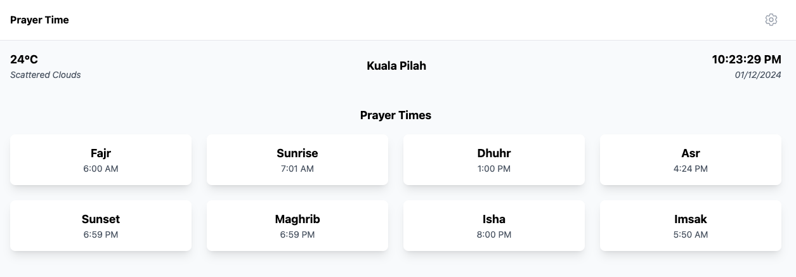
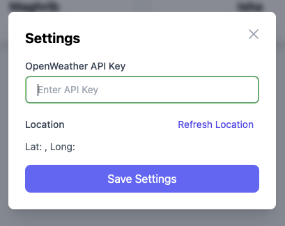

# Prayer Time App

A modern, responsive web application that displays Islamic prayer times and local weather information. Built with Alpine.js and Tailwind CSS, this app provides real-time updates of prayer schedules based on the user's location.

## Features

- 📍 Automatic location detection
- 🕌 Islamic prayer times display
- 🌤️ Local weather information
- 🕒 Real-time clock
- 💾 Persistent settings using localStorage
- 📱 Responsive design for all devices
- ⚡ No build process required

## Features

- Display of daily prayer times (Fajr, Sunrise, Dhuhr, Asr, Maghrib, Isha, etc.)
- Current time and date
- Local weather information (temperature and conditions)
- Location-based services
- Settings management through a modal interface

## Screenshots





## Prerequisites

To use this application, you'll need:

1. An OpenWeather API key (free tier available at [OpenWeather](https://openweathermap.org/api))
2. A modern web browser with JavaScript enabled
3. Internet connection for API calls

## Quick Start

1. Clone or download this repository
2. Open `index.html` in your web browser
3. Allow location access when prompted
4. Click the settings icon and enter your OpenWeather API key

## APIs Used

- [OpenWeather API](https://openweathermap.org/api) - For weather information
- [Aladhan API](https://aladhan.com/prayer-times-api) - For prayer times calculations
- Browser Geolocation API - For location detection

## Technologies Used

- [Alpine.js](https://alpinejs.dev/) - For reactive data management
- [Tailwind CSS](https://tailwindcss.com/) - For styling
- [Axios](https://axios-http.com/) - For API requests

## Local Development

The app can be served using any static file server. For example:

```bash
# Using Python
python -m http.server 8000

# Using Node.js and npx
npx serve
```

## Configuration

### Weather API

1. Sign up for a free API key at [OpenWeather](https://openweathermap.org/api)
2. Click the settings icon in the app
3. Enter your API key in the settings modal
4. Click "Save Settings"

### Location Settings

The app provides two ways to set your location:

1. **Automatic** - Allow browser location access when prompted
2. **Manual Refresh** - Use the "Refresh Location" button in settings

## Storage

The app uses localStorage to persist:

- OpenWeather API key
- Latest coordinates
- User preferences

## Browser Support

Supports all modern browsers including:

- Chrome
- Firefox
- Safari
- Edge

## Privacy Considerations

The app:

- Only stores data locally in your browser
- Requires location permission for accurate prayer times
- Makes API calls to OpenWeather and Aladhan services
- Does not track or store user data externally

## Contributing

Feel free to fork this repository and submit pull requests. You can also open issues for bugs or feature requests.

## License

MIT License - feel free to use this code for your own projects.

## Acknowledgments

- [OpenWeather](https://openweathermap.org/) for weather data
- [Aladhan](https://aladhan.com/) for prayer times calculations
- [Tailwind CSS](https://tailwindcss.com/) for the UI framework
- [Alpine.js](https://alpinejs.dev/) for the reactive framework
